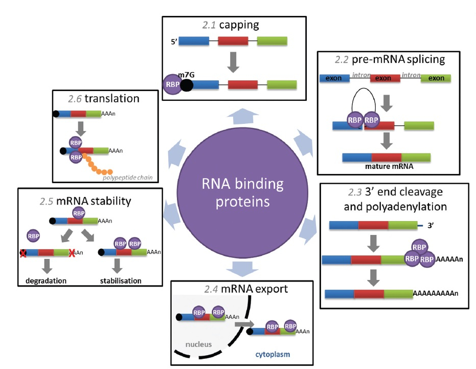
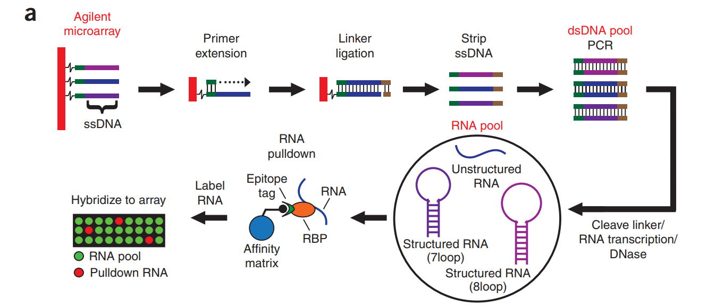
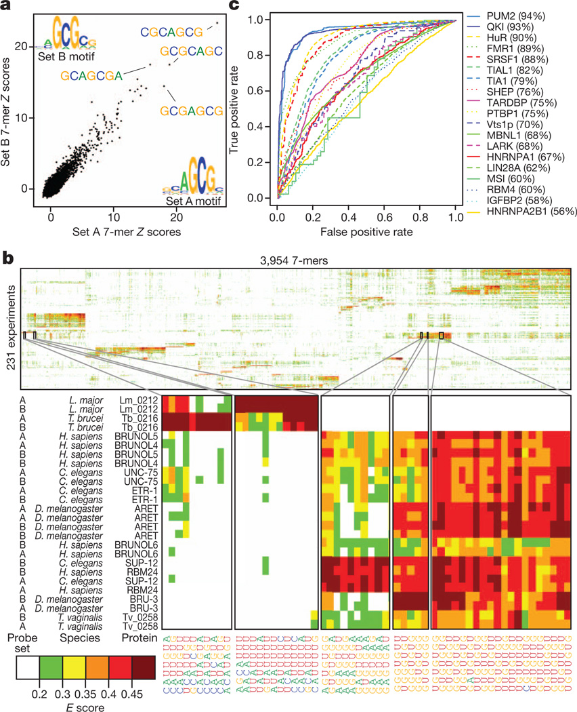
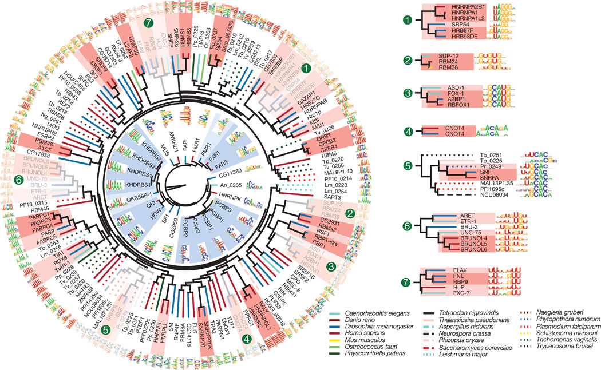
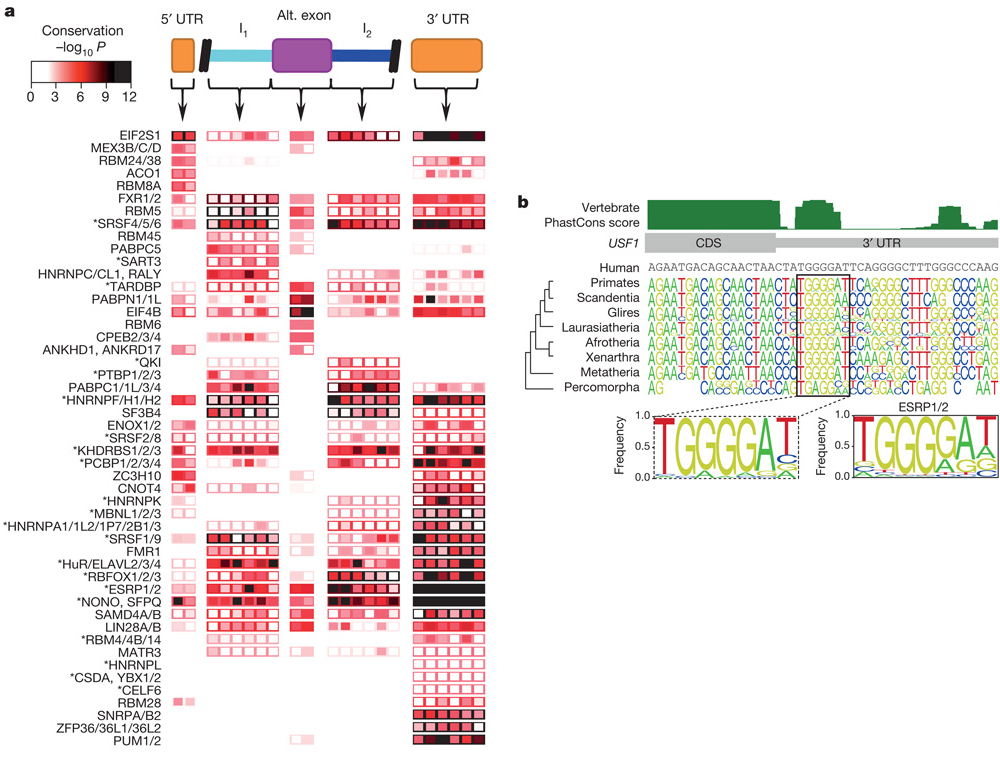
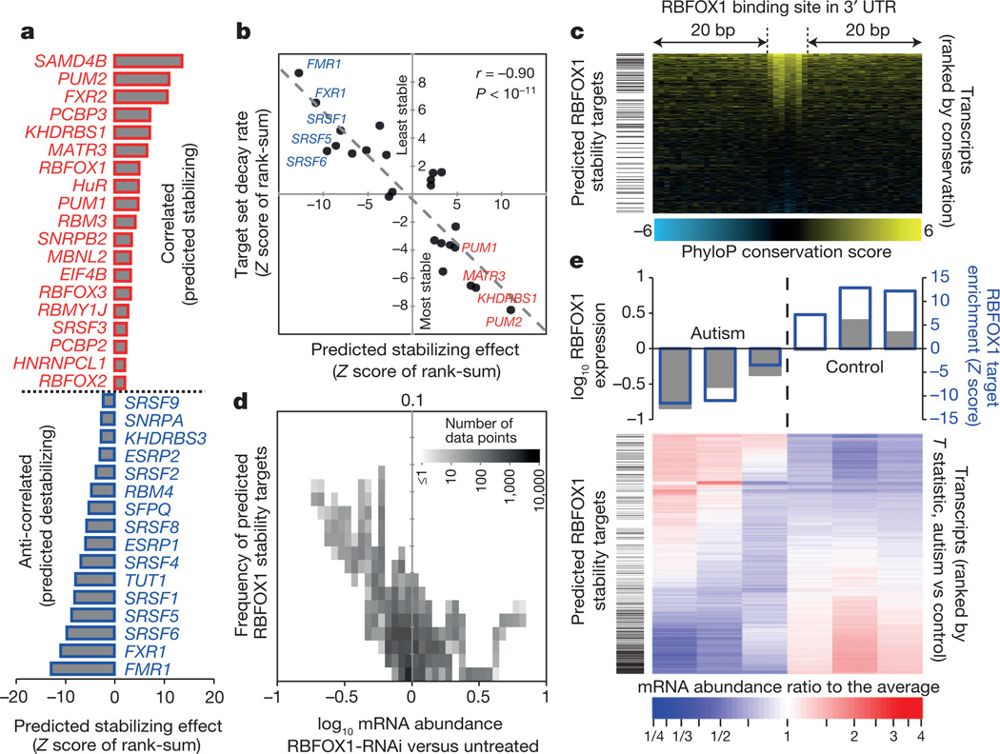

% A compendium of RNA-binding motifs for decoding gene regulation
% Ray D., et al. Nature, 2013, vol. 499, pp. 172-177
% \today

# Introduction
## RNA-binding proteins (RBPs)
- Are proteins binding to double or single stranded RNA in cells.
- Regulate numerous aspect of co- and post-transcriptional gene expression
    - RNA splicing, capping, polyadenylation, mRNA export, etc.

## RNA-binding proteins (RBPs)
{ width=80% }

## RNA-binding domains (RBDs)
### Functions
- Recognize RNA: bind short, single-stranded RNA sequences, or structured RNAs.

### Types
- RNA recognition motif, hnRNP K-homology (KH), zinc finger domains, etc.

## Motivation: study of post-transcriptional regulation
Post-transcriptional regulation Contributes substantially to gene expression across human tissues.
However,

- Lack of motifs for the vast majority of RBPs across all branches of eukaryotes.
    - Due to higher flexibility of the RNA-protein interface for major types of RBPs;
    - Example: only 15% of human RBD-containing proteins have known RNA-binding motifs.
    
**This paper: identifies binding motifs for a broad range of RBPs**

# Methods
## `RNAcompete` experiments
- An _in vitro_, high-throughput method for the analysis of RNA binding preferences of hundreds of RBD-containing RBPs, from diverse eukaryotes.
- Rely on binding reaction between RBD and RNA-binding motifs.
    - An RBP is incubated in a complex pool of RNAs by affinity selection.
    - The pool contains ~240,000 short RNAs, divided into two halves for internal cross-validation purpose.
- The associated RNAs are interrogated by microarray and computational analyses.

## `RNAcompete` experiments
{ width=80% }

# Results
## Large-scale analysis of RBPs

Determined sequence preferences for 207 RBPs (from 193 unique RBP-encoding genes), 85 from human.

- Most RBDs fundamentally recognize and bind ssRNA, requires rarely on RNA second structure.
    - Fig. 1a: Z score and motifs for ZC3H10 (no previously known motif)
- Highlight specificity and diversity of RBP sequence preferences.
    - Fig. 1b: E score (enrichment score, Berger MF, et al., Nature Biotech 2006)
- The `RNAcompete` motif substantially outperforms the literature motif by AUROC analysis.
    - Fig. 1c: AUROC

## Figure 1
{ width=60% }

## Conservation of ancient motifs
- Groups of ancient RBP families retain closely related sequence preferences.
    - A2BP1/RBFOX1, BRUNO/ARET
    - all RBPs in the SUP12–RBM24–RBM38 cluster prefer similar (G+U)-rich sequences.
- Subtle differences between more distantly related proteins are found.
    -  family members from fungi, protists and algae maintained the presumed ancestral CAC core-recognition specificity, but differ in their preference for flanking nucleotides

## Conservation of ancient motifs
{ width=90% }

## RBD sequence identity enables inference of RNA motifs
- Amino acid sequence identity higher than ~70% yields very similar motifs
- `RNAcompete` data captured 57% of all human RBPs contained multiple RBDs, assuming 70% sequence identity
- Validation of motifs predicted for proteins at 61–96% amino acid identity

## RBD sequence identity enables inference of RNA motifs
{ width=90% }

## Sequence conservation of motif matches
- Motifs for most RBP families display significant conservation in one or more of the three regions examined.

## Sequence conservation of motif matches
{ width=70% }

## Insights into RBP multi-functionality
- Role of RBPs in mRNA stability: positive/negative regulator
    - For example: RBFOX1 positively regulates mRNA stability/stabilizes its predicted mRNA targets
- Reduction of the stability of RBFOX1 targets may affect nervous-system-specific processes
    - Levels of RBFOX1 in the brains of individuals with autism is associated with changes in alternative splicing of exons 

## Insights into RBP multi-functionality
{ width=70% }

# Discussion
## Significance of identified motifs
- represent an unprecedented resource for the analysis of post-transcriptional regulation across eukaryotes; 
- provide insight into the function and evolution of both RBPs and their binding sites; 
- reveal broad linkages among different post-transcriptional regulation processes; 
- uncover an unexpected role for a splicing factor in the control of transcript abundance that is mis-regulated in autism.