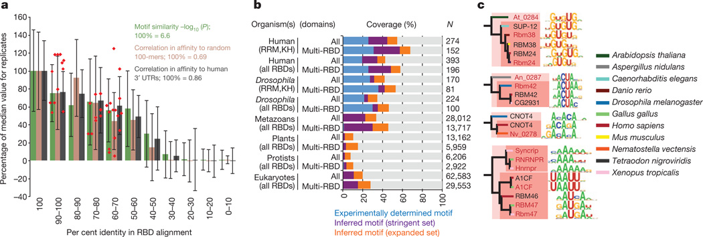

% A compendium of RNA-binding motifs for decoding gene regulation
% Ray D., et al. Nature, 2013, vol. 499, pp. 172-177
% \today

# Introduction
## RNA-binding proteins (RBPs)
- Proteins binding to double or single stranded RNA in cells
- Regulate numerous aspect of co- and post-transcriptional gene expression: RNA splicing, polyadenylation, capping, modification, export etc.

## .. 
{ width=80% }

## RNA-binding domains (RBDs)
- Recognize RNA: bind short, single-stranded RNA sequences, or structured RNAs
- RNA recognition motif, hnRNP K-homology (KH), zinc finger domains

## Issues
- Post-transcriptional regulation contributes substantially to gene expression across human tissues
- No data  on the sequence preferences of RBPs in most organisms
- Because of much higher flexibility of the RNA-protein interface for major types of BRPs, there is lack of motifs for the vast majority of RBPs across all branches of eukaryotes.
- Example: only 15% of human RBD-containing proteins have known RNA-binding motifs

# Methods
## `RNAcompete` experiments
- An _in vitro_ method for the analysis of RNA binding preferences of hundreds of RBD-containing RBPs, from diverse eukaryotes
- Rely on binding reaction between RBD and RNA-binding motifs
    - an RBP is incubated in a complex pool of RNAs by affinity selection
    - The pool contains ~240,000 short RNAs, divided into two halves for internal cross-validation purpose
- The associated RNAs are interrogated by microarray and computational analyses

# Results
## Large-scale analysis of RBPs
- Determined the sequence preferences for 207 different RBPs (products of 193 unique RBP-encoding genes), 85 from human
- Z score (Fig. 1a)
    - Most RBDs fundamentally recognize and bind ssRNA
- E score (Fig. 1b)
    - Highlight the specificity and diversity of RBP sequence preferences
- AUROC (Fig. 1c)
    -  the RNAcompete motif substantially outperforms the literature motif by AUROC analysis

## .. 
{ width=60% }

## Conservation of ancient motifs
- Groups of ancient RBP families retain closely related sequence preferences.
    - A2BP1/RBFOX1, BRUNO/ARET
    - all RBPs in the SUP12–RBM24–RBM38 cluster prefer similar (G+U)-rich sequences.
- Subtle differences between more distantly related proteins are found.
    -  family members from fungi, protists and algae maintained the presumed ancestral CAC core-recognition specificity17, but differ in their preferenceforflanking nucleotides

## Figure 3 
{ width=90% }

## Figure 4
- Amino acid sequence identity higher than ~70% yields very similar motifs
- RNAcompete data captured 57% of all human RBPs contained multiple RBDs, assuming 70% sequence identity
- Validation of motifs predicted for proteins at 61–96% amino acid identity

## .. 
{ width=90% }

## Sequence conservation of motif matches
- Motifs for most RBP families display significant conservation in one or more of the three regions examined.

## ..
{ width=70% }

## Insights into RBP multi-functionality
- Role of RBPs in mRNA stability: positive/negative regulator
    - For example: RBFOX1 positively regulates mRNA stability/stabilizes its predicted mRNA targets
- Reduction of the stability of RBFOX1 targets may affect nervous-system-specific processes
    - Levels of RBFOX1 in the brains of individuals with autism is associated with changes in alternative splicing of exons 

## .. 
{ width=70% }

# Discussion
## Significance
- The resulting motifs represent an unprecedented resource for the analysis of post-transcriptional regulation across eukaryotes; 
- provide insight into the function and evolution of both RBPs and their binding sites; 
- reveal broad linkages among different post-transcriptional regulation processes; 
- uncover an unexpected role for a splicing factor in the control of transcript abundance that is mis-regulated in autism.